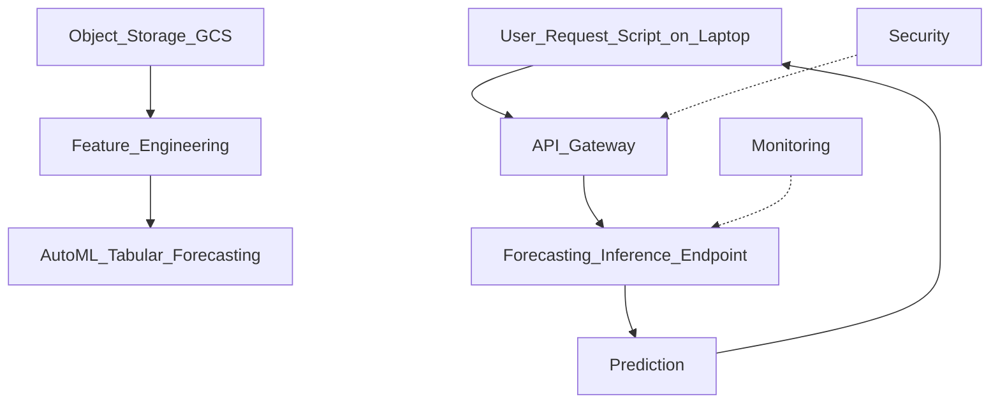

# Cloud-Native ML Platform — Week 5 (Air Quality Preprocessing)

Short description
- This repository contains a preprocessing pipeline for an air quality time-series dataset prepared for Google Vertex AI AutoML forecasting.

Repository structure
- scripts/preprocessing.py — main preprocessing script implementing the pipeline and logging.
- pyproject.toml — project dependencies and tooling.
- planning_graph.mmd — platform flow diagram (Mermaid).
- data/air_quality_dataset/measurements.csv — raw input measurements.
- data/air_quality_dataset/measurements_cleaned.csv — cleaned output (generated).
- data/air_quality_dataset/stations.csv — station metadata.
- logs/preprocessing.log — preprocessing run logs.
- .gitignore

What the preprocessing script does
- The pipeline is implemented in scripts/preprocessing.py. Key steps:
  - load CSV and validate load
  - keep only relevant columns and remove duplicate header rows
  - coerce the target (`value`) to numeric and log basic stats
  - parse and standardize `datetimeUtc` timestamps
  - median imputation for numeric fields and drop rows missing required keys
  - deduplicate on `location_id` and `datetimeUtc`, sort, and save cleaned CSV
  - logging via loguru to logs/preprocessing.log

Usage
1. Install dependencies (poetry):
```sh
poetry install
```

2. Run the preprocessing script:
```sh
python scripts/preprocessing.py
```

Notes
- Default input/output paths in the script:
  - Input: /home/huyvu/Projects/week5/data/air_quality_dataset/measurements.csv
  - Output: /home/huyvu/Projects/week5/data/air_quality_dataset/measurements_cleaned.csv
  Adjust paths in scripts/preprocessing.py if running from a different location.
- Check logs/preprocessing.log for run details and errors.

Planning diagram
- The repository includes a Mermaid flowchart describing the platform flow. Render it with any Mermaid-capable viewer (VS Code Mermaid Preview, GitLab/GitHub markdown rendering if mermaid enabled, or mermaid CLI).

Mermaid source (planning_graph.mmd):


Quick troubleshooting
- If the script errors about missing columns, confirm the raw CSV contains expected columns and inspect the columns_to_keep list in scripts/preprocessing.py.
- If paths or permissions fail, verify directories exist and are writable — logs will contain error details.

License
- (Add project license here)